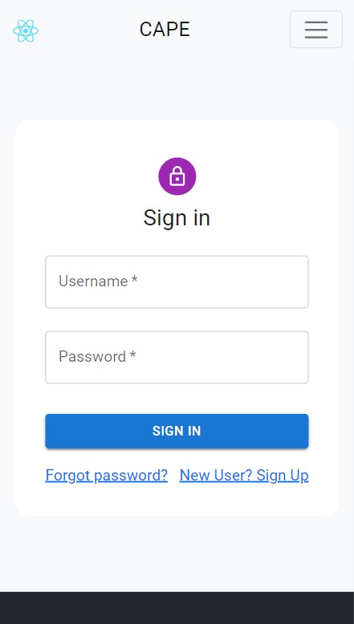

# CAPE
Coding Analysis For Programming Enthusiast

<b>CAPE is a MERN-based full-stack project which allows programmers across the globe to analyze their coding
performances, refer to various ongoing and upcoming contests, and set reminders for themselves.</b>

## Motivation

Coding is an essential aspect of one’s skill set. Various coding platforms are being evolved day by day.  From running up an e-commerce store to doing gene sequencing everywhere, coding has made its way. With companies taking the programmers regardless of their age, the demand for world-class coders is evolving eventually. Keeping that in mind, we came up with a platform where we will analyze all the data collected from various coding platforms that users actively participate or practice in and show the result analysis so that they can improve in the areas where they lack. They can also have a track of the solved and unsolved problems along with the type of problems they approached till now. 

C.A.P.E assists the programmers in getting an analysis based on their coding journey. In other words, there are websites like CodeChef, CodeForces, etc., where many of the coders practice and participate in contests. Our application first registers the users on the website seeking the necessary details and their coding handles. After successful registration, we run APIs on the given coding handles and collect the data from several coding platforms and then store it on our database. The data, in turn, is analyzed by our model, and a final statistical analysis is provided to the users. Based on the statistical analysis of the user’s skills, we will provide them with a series of website links for specific topics where they can refer. The user also receives a profile link that he can share with the companies for hiring purposes. The company can use that profile link to understand the user’s level in programming. The proposed application also serves users with a portal where they can find all the upcoming and ongoing contest lists. 

## Instructions to run application:

1. Clone the Project
      
2. Go to Terminal and type

        cd cape-app

3. Then run the development server by using below

        npm start
        
4. Now go back and to the root folder and open backend folder. Then open the terminal and type

        cd login-server
        
5. Then type the below to start the server

        nodemon server.js
        

6. In the project uploaded the backend is already deployed on Heroku which can be found at:

        https://lit-stream-06295.herokuapp.com/
        
7. For detailed documentation and bug fixes please open issues. 

## Tech stack and Modules used:

        Frontend : HTML, CSS, JavaScript, ReactJS, Bootstrap, Material UI, FontAwesome, Google Fonts
        
        Libraries : LottieFiles, EmailJS, Mongoose, TypeWriter, React DOM Router, ChartJS
        
        Middleware/Backend : NodeJS, ExpressJS
        
        Database :  MongoDB
        
        Cloud: Amazon Web Services(AWS), Heroku
        
        Tools: Postman, Heroku CLI, Git
        
        APIs used: Kontests API, News API, CodeChef API, Codeforces API, Github API
        
        
## ScreenShots

### Home page

### Login page

### Register page

### About page

### Contests page

### News page

### Dashboard page

### Services page

### Responsive Design

   

## Contact Me ✨

Reach out to me for such works, if you liked this :)

<table>
  <tr>
    <td align="center"><a href="https://github.com/moit-bytes"> <b>Mohit Kumar</b></a> </td>
  </tr>
</table>
